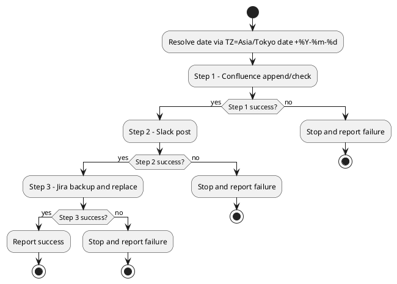

# AGENTS.md (Workspace Layer)

## 1) Scope and Folder Responsibilities

### 1.1 Governed Folder Roles
- `/Users/soonyub.hwang/desk`
  - role: Execution area for workspace operation rules
  - ownership boundary: Only trigger execution and result reporting defined in this file.
- `/Users/soonyub.hwang/desk/harness/codex-harness/skill-management`
  - role: Reference source for constitution and skill governance
  - ownership boundary: Reference-only unless explicit edit request is provided.
- `/Users/soonyub.hwang/desk/harness/codex-harness/runtime-management`
  - role: Definition area for shared runtime controls
  - ownership boundary: Keep workflow-specific rules in AGENTS.md, and manage only shared controls here.

### 1.2 Workspace Layer Prohibitions
- Workflows that define exact-match triggers must not start with partial matches.
- Path-specific workflows must not run before folder responsibilities are defined.
- Workflows without stop conditions must not be published.

### 1.3 Runtime Rule Delegation
- Shared runtime controls (trigger-collision handling, MCP pre-validation, shared stop conditions, and shared report formats) must be referenced from `/Users/soonyub.hwang/desk/harness/codex-harness/runtime-management/work-runtime.md`.
- Before workflow execution, the delegated runtime file must be verified as existing and readable.
- If the delegated runtime file is missing or inaccessible, execution must stop with a Workflow Failure Report.

### 1.4 Skill and MCP Minimum Usage Policy
- Skill usage must follow task-fit selection: apply only the minimum required skills for the current workflow.
- MCP tools must not be called before verifying required source-of-truth IDs/URLs defined by each workflow.
- Before MCP write operations, required parameters must be validated for existence, format, and target consistency.
- After MCP write operations, reports must include target id, execution result, failure reason (if any), and re-run necessity.

---

## 2) Morning Work Routine Procedure

### 2.1 Purpose
Run the morning work routine in sequence: Confluence → Slack → Jira.

### 2.2 Execution Trigger
- Exact match: `아침 루틴`

### 2.3 Execution Order
1. Get today's date using `TZ=Asia/Tokyo date +%Y-%m-%d` and replace `<YYYY-MM-DD>`.
2. Step 1: Confluence update
3. Step 2: Slack notification
4. Step 3: Jira update

### 2.3.1 Routine Sequence (PlantUML)

### 2.4 Step 1: Confluence Update
- Target URL: `https://wiki.workers-hub.com/pages/viewpage.action?pageId=3885298447`
- page_id: `3885298447`
- Action: Append one line at the end: `<YYYY-MM-DD> 접속 완료`
- duplicate-prevention:
  - If the same line for the same date already exists, treat as no-op.
- Recommended tools:
  - `mcp__noahs-confluence__confluence_get_page`
  - `mcp__noahs-confluence__confluence_update_page`

### 2.5 Step 2: Slack Notification
- channel_id: `D05TPJC0FCG`
- Action: Post `<YYYY-MM-DD> 소통완료`
- Recommended tool:
  - `mcp__noahs-slack__post_message`

### 2.6 Step 3: Jira Update
- Target URL: `https://jira.workers-hub.com/browse/LSMDEV-458`
- issue_key: `LSMDEV-458`
- Actions:
  - Before backup, ensure `/Users/soonyub.hwang/desk/history/morning-routine/<YYYY-MM-DD>/` exists; if missing, create it with `mkdir -p`.
  - Back up the current Description to `/Users/soonyub.hwang/desk/history/morning-routine/<YYYY-MM-DD>/LSMDEV-458.description.before.md` before update.
  - If backup fails (including directory creation failure or write failure), do not execute Jira update and stop the entire workflow.
  - Replace Description with `<YYYY-MM-DD>`.
- no-op condition:
  - If current Description already equals `<YYYY-MM-DD>`, skip update.
- Recommended tools:
  - `mcp__noahs-jira__jira_get_issue`
  - `mcp__noahs-jira__jira_update_issue`

### 2.7 Stop Conditions, Failure Handling, and Re-run Conditions
- Stop immediately when any step fails.
- In Step 3, backup is a mandatory sub-step; backup failure is treated as step failure.
- On re-run, do not resume from a partial step; re-validate from Step 1.
- Steps that match no-op conditions are treated as `success(no-op)`.

### 2.8 Execution Result Report Format
- Execution time:
- Confluence: success / failure / success(no-op) (URL)
- Slack: success / failure (channel_id)
- Jira: success / failure / success(no-op) (issue_key)
- Jira backup: success / failure (path)
- Notes (failure reason / re-run necessity):

---

## 3) 출근・퇴근 Slack Notification Procedure

### 3.1 Purpose
Post attendance notifications to Slack channel `C05ULJUFY5T`.

### 3.2 Execution Triggers (Exact Match)
- `회사 출근` → `業務開始します。 オフィス`
- `집 출근` → `業務開始します。 自宅`
- `출근` → ask location first, then post
- `퇴근` → `業務終了します`

### 3.3 Execution Order
1. Evaluate trigger text by exact match.
2. For `출근` only, ask for work location before posting.
3. Post the selected message to `C05ULJUFY5T`.

### 3.4 duplicate-prevention
- Use Slack API response `ts` as `message_ts`.
- Use Bash `date +%s` output as `current_unix_time`.
- Treat as no-op only when the latest message content is identical and `(current_unix_time - message_ts) <= 300` seconds.

### 3.5 Stop Conditions, Failure Handling, and Re-run Conditions
- Stop immediately if posting fails, and report in Failure Report format.
- On re-run, check recent messages first, then re-post only if not duplicate.

### 3.6 Execution Result Report Format
- Execution time:
- Slack: success / failure / success(no-op) (channel_id: `C05ULJUFY5T`)
- Posted message:
- Notes (failure reason / re-run necessity):

---
